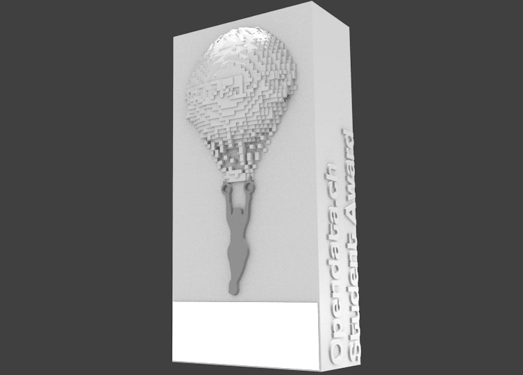
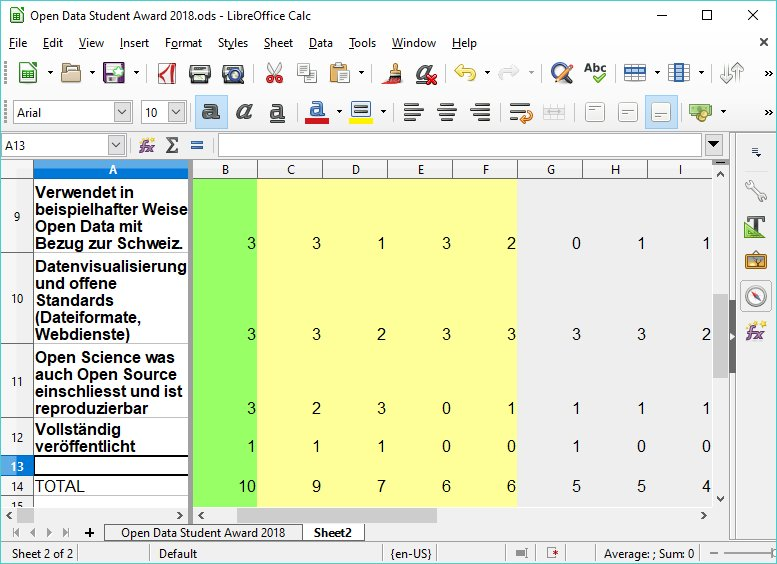

# Open Data Student Award 2018

Materials from the [Open Data Student Award](https://opendata.ch/2018/07/results-open-data-student-award-2018/), launched at Opendata.ch/2018 and based on the [conference theme](text/conference-flyer-2018.jpg).

The accepted nominations - which can be seen at [hack.opendata.ch/event/19](http://hack.opendata.ch/event/19) - were evaluated according to the following criteria:

- The student work uses Open Data and/or Open Government Data (OGD) with reference to Switzerland in an exemplary manner.
- It uses data visualization and open standards (file formats, web services) where appropriate.
- It ideally stands for Open Science which also includes Open Source and is reproducible including raw data and program scripts.
- The author agrees to the submission and publication of the work and the media (photos and videos).

For the full acceptance criteria [see blog post](https://opendata.ch/2018/02/open-data-student-award/), copies of which (French/German) are included in the `text` folder.

## Trophy

Designed and produced by [Oleg Lavrovsky](https://www.datalets.ch) using open source software: [Blender](https://www.blender.org/) (3D modelling and animation), [GIMP](https://www.gimp.org/) (textures and 2D stills), [Inkscape](https://inkscape.org/) (2D shapes), [Pitivi](http://www.pitivi.org/) (video production).

3D printed by My3Dworld Zürich
https://www.my3dworld.ch/

Uses Coolvetica by Typodermic Fonts
https://www.dafont.com/coolvetica.font

Uses images from NASA
https://www.nasa.gov/content/moonlit-panorama-of-western-united-states

Parts of the model "The Skylift" by MakerBot were used
https://www.thingiverse.com/thing:220564

This work is licensed under a Creative Commons Attribution-NonCommercial-ShareAlike 4.0 International License.
http://creativecommons.org/licenses/by-nc-sa/4.0/